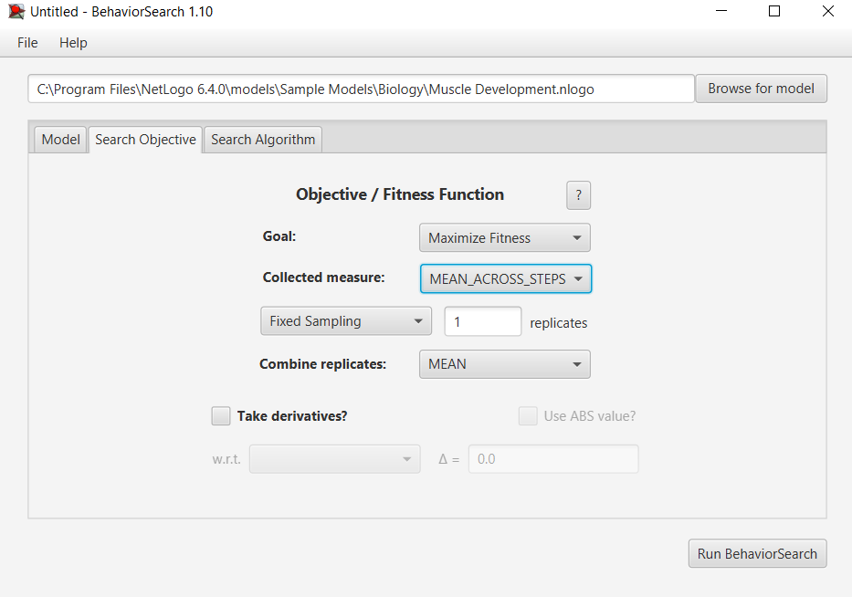

## Комп'ютерні системи імітаційного моделювання
## СПм-22-4, **Комаричев Андрій Валерійович**
### Лабораторна робота №**3**. Використання засобів обчислювального интелекту для оптимізації імітаційних моделей

 

### Варіант 12, модель у середовищі NetLogo:

- **https://github.com/zddarova/KCIM_lb1**

 

### Налаштування середовища BehaviorSearch:

**Обрана модель**:
<pre>
C:\Program Files\NetLogo 6.4.0\models\Sample Models\Biology\Muscle Development.nlogo
</pre>
**Параметри моделі**:  
<pre>
["days-between-workouts" [1 1 30]]
["hours-of-sleep" 8]
["intensity" [50 1 100]]
["lift?" true false]
["%-slow-twitch-fibers" [0 1 100]]

</pre>
Використовувана **міра**:  
Для фітнес-функції  було обрано **кількість анаболічних гормонів**, вираз для розрахунку взято з налаштувань графіка аналізованої імітаційної моделі в середовищі NetLogo  

  

та вказано у параметрі "**Measure**":

<pre>
mean [anabolic-hormone] of patches - mean [catabolic-hormone] of patches
</pre>

Кількість анаболічних гормонів повинна враховуватися **в середньому** за весь період симуляції тривалістю, 300 тактів , починаючи з 0 такту симуляції.  
Параметр зупинки за умовою ("**Stop if**") не використовувався. Значення годин сну встанолено завжди на 8.
Загальний вигляд вкладки налаштувань параметрів моделі:  

**Налаштування цільової функції**:  
Метою підбору параметрів імітаційної моделі, що описує ріст мускулів, є **максимізація** значення анаболічних гормонів – це вказано через параметр "**Goal**" зі значенням **Maximize Fitness**.
Тобто необхідно визначити такі параметри налаштувань моделі, у яких кількість анаболітичних гормонів є максимальною. При цьому цікавить не просто значення у якийсь окремий момент симуляції, а середнє значення за всю симуляцію. Для цього у параметрі "**Collected measure**", що визначає спосіб обліку значень обраного показника, вказано **MAEN_ACROSS_STEPS**. Симуляція буде виконуватись всього 1 раз.
Загальний вигляд вкладки налаштувань цільової функції:  

**Налаштування алгоритму пошуку** (вкладка Search Algorithm):  
Загальний вид вкладки налаштувань алгоритму пошуку:  

 

### Результати використання BehaviorSearch:
Діалогове вікно запуску пошуку:  

Результат пошуку параметрів імітаційної моделі, використовуючи **генетичний алгоритм**:  

Результат пошуку параметрів імітаційної моделі, використовуючи **випадковий пошук**:  

Випадковий пошук показав себе набагато краще і видав результат, коли м'ясова маса неймовірно висока. Звісно це було досягнуто за допомогою максимізації анаболітичного гормону:

